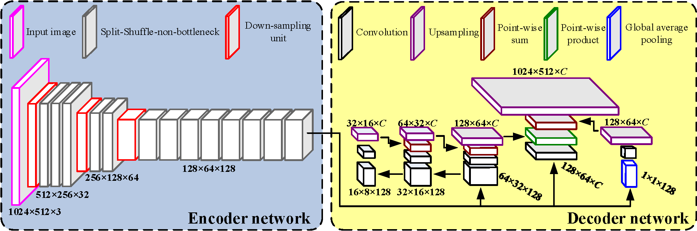
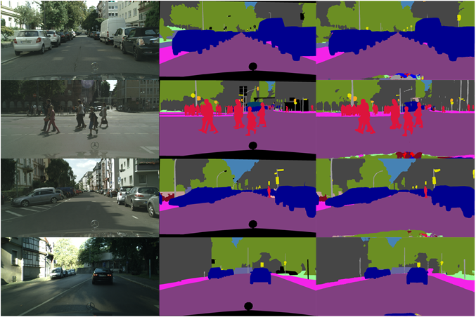

###  [LEDNet: A Lightweight Encoder-Decoder Network for Real-time Semantic Segmentation](https://github.com/xiaoyufenfei/LEDNet)

[![python-image]][python-url]
[![pytorch-image]][pytorch-url]

#### Table of Contents:
- <a href='#Introduction'>Introduction</a>
- <a href='#Project-Structure'>Project Structure</a>
- <a href='#Installation'>Installation</a>
- <a href='#Datasets'>Datasets</a>
- <a href='#Training-LEDNet'>Train</a>
- <a href='#Resuming-training-if-decoder-part-broken'>Resuming training</a>
- <a href='#Testing'>Test</a>
- <a href='#Results'>Results</a>
- <a href='#Citation'>Reference</a>
- <a href='#Tips'>Tips</a>

#### Introduction

This project contains the code (Note: The code is test in the environment with python=3.6, cuda=9.0, PyTorch-0.4.1, also support Pytorch-0.4.1+) for:  [**LEDNet: A Lightweight Encoder-Decoder Network for Real-time Semantic Segmentation**](https://arxiv.org/pdf/1905.02423.pdf)  by [Yu Wang](https://github.com/xiaoyufenfei).

<p align="center"></p>
The extensive computational burden limits the usage of CNNs in mobile devices for dense estimation tasks, a.k.a semantic segmentation. In this paper, we present a lightweight network to address this problem, namely **LEDNet**, which employs an asymmetric encoder-decoder architecture for the task of real-time semantic segmentation.More specifically, the encoder adopts a ResNet as backbone network, where two new operations, channel split and shuffle, are utilized in each residual block to greatly reduce computation cost while maintaining higher segmentation accuracy. On the other hand, an attention pyramid network (APN) is employed in the decoder to further lighten the entire network complexity. Our model has less than 1M parameters, and is able to run at over 71 FPS on a single GTX 1080Ti GPU card. The comprehensive experiments demonstrate that our approach achieves state-of-the-art results in terms of speed and accuracy trade-off on Cityscapes dataset. and becomes an effective method for real-time semantic segmentation tasks.

#### Project-Structure
```
├── datasets  # contains all datasets for the project
|  └── cityscapes #  cityscapes dataset
|  |  └── gtCoarse #  Coarse cityscapes annotation
|  |  └── gtFine #  Fine cityscapes annotation
|  |  └── leftImg8bit #  cityscapes training image
|  └── cityscapesscripts #  cityscapes dataset label convert scripts！
├── utils
|  └── dataset.py # dataloader for cityscapes dataset
|  └── iouEval.py # for test 'iou mean' and 'iou per class'
|  └── transform.py # data preprocessing
|  └── visualize.py # Visualize with visdom 
|  └── loss.py # loss function 
├── checkpoint
|  └── xxx.pth # pretrained models encoder form ImageNet
├── save
|  └── xxx.pth # trained models form scratch 
├── imagenet-pretrain
|  └── lednet_imagenet.py # 
|  └── main.py # 
├── train
|  └── lednet.py  # model definition for semantic segmentation
|  └── main.py # train model scripts
├── test
|  |  └── dataset.py 
|  |  └── lednet.py # model definition
|  |  └── lednet_no_bn.py # Remove the BN layer in model definition
|  |  └── eval_cityscapes_color.py # Test the results to generate RGB images
|  |  └── eval_cityscapes_server.py # generate result uploaded official server
|  |  └── eval_forward_time.py # Test model inference time
|  |  └── eval_iou.py 
|  |  └── iouEval.py 
|  |  └── transform.py 
```

#### Installation
- Python 3.6.x. Recommended using [Anaconda3](https://www.anaconda.com/distribution/)
- Set up python environment

```
pip3 install -r requirements.txt
```

- Env: PyTorch_0.4.1; cuda_9.0; cudnn_7.1; python_3.6, 

- Clone this repository.

```
git clone https://github.com/xiaoyufenfei/LEDNet.git
cd LEDNet-master
```

- Install [Visdom](https://github.com/facebookresearch/visdom).
- Install [torchsummary](https://github.com/sksq96/pytorch-summary)
- Download the dataset by following the **Datasets** below.
- Note: For training, we currently support [cityscapes](https://www.cityscapes-dataset.com/) , aim to add [Camvid](https://github.com/alexgkendall/SegNet-Tutorial/tree/master/CamVid)  and  [VOC](http://host.robots.ox.ac.uk/pascal/VOC/)  and  [ADE20K](http://groups.csail.mit.edu/vision/datasets/ADE20K/)  dataset

#### Datasets
- You can download [cityscapes](https://www.cityscapes-dataset.com/) from [here](https://www.cityscapes-dataset.com/downloads/). Note: please download [leftImg8bit_trainvaltest.zip(11GB)](https://www.cityscapes-dataset.com/file-handling/?packageID=4) and [gtFine_trainvaltest(241MB)](https://www.cityscapes-dataset.com/file-handling/?packageID=1) and [gtCoarse(1.3GB)](https://www.cityscapes-dataset.com/file-handling/?packageID=1).
- You can download [CityscapesScripts](https://github.com/mcordts/cityscapesScripts), and convert the dataset to [19 categories](https://github.com/mcordts/cityscapesScripts/blob/master/cityscapesscripts/helpers/labels.py). It should have this basic structure.

```
├── leftImg8bit
│   ├── train
│   ├──  val
│   └── test
├── gtFine
│   ├── train
│   ├──  val
│   └── test
├── gtCoarse
│   ├── train
│   ├── train_extra
│   └── val
```

#### Training-LEDNet

- For help on the optional arguments you can run: `python main.py -h`

- By default, we assume you have downloaded the cityscapes dataset in the `./data/cityscapes` dir.
- To train LEDNet using the train/main.py script the parameters listed in `main.py` as a flag or manually change them.

```
python main.py --savedir logs --model lednet --datadir path/root_directory/  --num-epochs xx --batch-size xx ...
```

#### Resuming-training-if-decoder-part-broken

- for help on the optional arguments you can run: `python main.py -h`

```
python main.py --savedir logs --name lednet --datadir path/root_directory/  --num-epochs xx --batch-size xx --decoder --state "../save/logs/model_best_enc.pth.tar"...
```

#### Testing

- the trained models of training process can be found at [here](https://github.com/xiaoyufenfei/LEDNet/save/). This may not be the best one, you can train one from scratch by yourself or Fine-tuning the training decoder with  model encoder pre-trained on ImageNet, For instance

```
more details refer ./test/README.md
```

#### Results

- Please refer to our article for more details.

|Method|Dataset|Fine|Coarse| IoU_cla |IoU_cat|FPS|
|:-:|:-:|:-:|:-:|:-:|:-:|:-:|
|**LEDNet**|**cityscapes**|yes|yes|**70.6​%**|**87.1​%​**|**70​+​**|

qualitative segmentation result examples:

<p align="center"></p>

#### Citation

If you find this code useful for your research, please use the following BibTeX entry.

```
 @article{wang2019lednet,
  title={LEDNet: A Lightweight Encoder-Decoder Network for Real-time Semantic Segmentation},
  author={Wang, Yu and Zhou, Quan and Liu, Jia and Xiong，Jian and Gao, Guangwei and Wu, Xiaofu, and Latecki Jan Longin},
  journal={arXiv preprint arXiv:1905.02423},
  year={2019}
}
```

#### Tips

- Limited by GPU resources, the project results need to be further improved...
- It is recommended to pre-train Encoder on ImageNet and then Fine-turning Decoder part. The result will be better.

#### Reference

1. [**Deep residual learning for image recognition**](https://arxiv.org/pdf/1512.03385.pdf)
2. [**Enet: A deep neural network architecture for real-time semantic segmentation**](https://arxiv.org/pdf/1606.02147.pdf)
3. [**Erfnet: Efficient residual factorized convnet for real-time semantic segmentation**](https://ieeexplore.ieee.org/stamp/stamp.jsp?tp=&arnumber=8063438)
4. [**Shufflenet: An extremely efficient convolutional neural network for mobile devices**](https://arxiv.org/pdf/1707.01083.pdf)

<!--
[![python-image]][python-url]
[![pytorch-image]][pytorch-url]
-->

[python-image]: https://img.shields.io/badge/Python-3.x-ff69b4.svg
[python-url]: https://www.python.org/
[pytorch-image]: https://img.shields.io/badge/PyTorch-1.0-2BAF2B.svg
[pytorch-url]: https://pytorch.org/